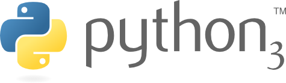

# :stars: Instalacion con Python 3.8

> Para esto **se toma como directorio raiz** la carpeta `src/` por lo que todos los
comandos mostrados se ejecutan dentro de esta carpeta

## Ambiente virtual

Existen scripts hechos para la creacion del ambiente virtual

* Ejecutar `./scripts/python/env.sh`

Para salir de la virtual env ejecutar `deactivate`
En caso de querer actualizar el archivo **requirements.txt** se puede ejecutar `./scripts/python/update-requirements.sh`

## Correr con Flask

Dentro del ambiente virtual creado ejecutar: `python app.py`

## Puertos

* **5000**: api web de la aplicacion

## Carpetas generadas

* **resources/logs**: Logs de la aplicacion, todos los archivos generados tienen extension *.log*

---

[Volver al readme principal](../README.md)